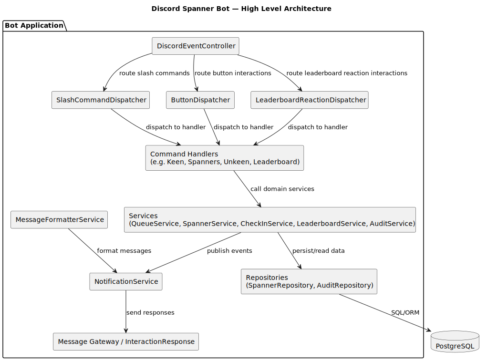
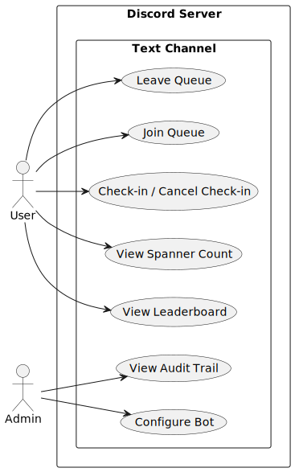

# Discord Spanner Bot

This repository contains a Discord bot that tracks "spanners" per user and channel. It uses PostgreSQL for persistence and Flyway for database migrations. Docker helpers are included to run a local PostgreSQL instance for development.

This README is a project-root overview and developer quickstart. For Docker-specific details see `docker/README.md`.

---

## Quick overview

- Language: Java (Spring Boot)
- Build: Maven
- Database: PostgreSQL (local, via Docker Compose for development)
- Migrations: Flyway (managed by the application)

---

## Prerequisites

Before you can run the bot locally, you need to set up a few things.

1) Discord bot
- Create a Discord application and bot at https://discord.com/developers/applications
- Add the bot to your guild (server) with appropriate permissions. Typical permissions required depend on which features you use (send messages, read message history, manage messages, interact with slash commands). At minimum give the bot permission to send messages and read message history in channels it operates in.
- Copy the bot token — you'll set this as the `SPANNER_BOT_TOKEN` environment variable when running the application.

2) Developer environment
- Java 25
- Maven (the project uses the bundled `./mvnw` wrapper; no global maven install required)
- Docker Desktop (for running the local PostgreSQL container), including Docker Compose

3) Project environment variables (required)
The Docker helper scripts and the Spring Boot application expect the following environment variables to be set (or provided in `docker/.env`):

- `SPANNER_BOT_DB_NAME` — PostgreSQL database name
- `SPANNER_BOT_DB_USERNAME` — DB user
- `SPANNER_BOT_DB_PASSWORD` — DB password
- `SPANNER_BOT_DB_PORT` — host port mapping (e.g., 5432)
- `SPANNER_BOT_TOKEN` — Discord bot token (application runtime)
- `SPANNER_BOT_DB_URL` — JDBC url (application runtime, e.g. `jdbc:postgresql://localhost:5432/spanner_bot`)

---

## Quick start (local development)

This quickstart assumes you have Docker and the project prerequisites from above.

1. Prepare credentials
- Create `docker/.env` (copy `docker/.env.example`) and fill in the database values, for example:

```env
SPANNER_BOT_DB_NAME=spanner_bot_db
SPANNER_BOT_DB_USERNAME=username
SPANNER_BOT_DB_PASSWORD=password
SPANNER_BOT_DB_PORT=5432
```

2. Start the local database
- Windows (PowerShell):

```powershell
cd docker
.\start-db.bat
```

- macOS / Linux:

```bash
cd docker
./start-db.sh
```

The scripts will load `docker/.env` and validate required variables.

3. Set application environment variables (in the shell you will start the app from)

PowerShell example:
```powershell
$env:SPANNER_BOT_DB_URL = "jdbc:postgresql://localhost:5432/spanner_bot"
$env:SPANNER_BOT_DB_USERNAME = "spanner_bot"
$env:SPANNER_BOT_DB_PASSWORD = "super_secret_local_password"
$env:SPANNER_BOT_TOKEN = "<your-discord-bot-token>"
```

Bash example:
```bash
export SPANNER_BOT_DB_URL="jdbc:postgresql://localhost:5432/spanner_bot"
export SPANNER_BOT_DB_USERNAME="spanner_bot"
export SPANNER_BOT_DB_PASSWORD="super_secret_local_password"
export SPANNER_BOT_TOKEN="<your-discord-bot-token>"
```

4. Run the app from source

- Using the Maven wrapper (recommended for development):

```bash
./mvnw spring-boot:run
```

- Or run a compiled JAR (build first):

```bash
./mvnw clean package -DskipTests
export SPANNER_BOT_VERSION_NUMBER="3.0.0"   # match the built artifact version
java -jar target/discord-spanner-bot-${SPANNER_BOT_VERSION_NUMBER}-SNAPSHOT.jar
```

Once the application starts it will connect to the DB and Flyway will run migrations automatically.

5. Resetting the database

If you need to wipe data and reinitialize the DB (for example after changing credentials or migrations), run the reset script:

```bash
# Windows
cd docker
.\reset-db.bat

# Linux/macOS
cd docker
./reset-db.sh
```

This deletes the Docker volume containing the DB data and restarts a fresh DB instance.

---

## Database migrations and pre-population

- Flyway migrations live in `src/main/resources/db/migration/` and are executed by the application on startup.
- If you want to pre-populate data when the container starts, prefer Flyway callbacks (SQL scripts under `db/migration` or Flyway `afterMigrate` callbacks) so Flyway remains the single source of truth.
- If you do use Docker `init-scripts` for fast local initialization, be aware that these run only on first container initialization (empty volume) and may conflict with Flyway unless you use Flyway baseline (`spring.flyway.baseline-on-migrate=true`) or ensure the init-scripts create the same state as Flyway expects.

---

## Testing

- The test suite uses Testcontainers for integration tests that require a database; the test container provides its own DB credentials and does not rely on your local `docker/.env` values.
- Unit tests do not require Docker.

---

## Bot functionality

The bot exposes the following slash commands:

- `/spanners <user [optional]>` — Query the spanner count for yourself or another user in the current channel. Example: `/spanners @user` or just `/spanners` to check your own count.
- `/keen` (alias `/k`) — Join the "keen" queue for an activity in the channel. The bot maintains a per-channel queue and will notify when a check-in starts.
- `/unkeen` — Leave the queue; if the user is in an active check-in session it will cancel check-in and update the queue accordingly.
- `/keeners` — Show the current queue for the channel and the maximum queue size.
- `/leaderboard` — Display a paginated leaderboard of spanner counts for users in the channel.

### Check-in flow
- `/keen` to join the queue
- When the queue reaches maximum capacity, a check-in session starts.
- Check-in or cancel using provided buttons

### Spanner tracking
- The bot tracks "spanners" per user and channel.
- Spanners are awarded if a user actively leaves the queue or fails to check in during a check-in session.

### Timeouts
- A user is removed from the queue 1 hour after joining if a check-in session has not started.
- Check-in sessions have a 5-minute window once started.

---

## Project requirements

- Java 25
- Maven (you can use the bundled `./mvnw` wrapper)
- Docker Desktop (for running test/local PostgreSQL)
- Discord bot (token and appropriate guild permissions)

---

## Diagrams

PlantUML sources are available under `docs/diagrams/`. You can render them with a PlantUML tool / plugin / extension.

- `docs/diagrams/use-case.puml` — Use case diagram showing primary user interactions
- `docs/diagrams/architecture.puml` — High-level architecture diagram (controllers -> handlers -> services -> repository -> DB)

### Rendered architecture

Below is the rendered high-level architecture diagram (SVG):





Example (render with PlantUML):

```bash
# render as PNG (if plantuml is installed)
plantuml docs/diagrams/use-case.puml
```

---
